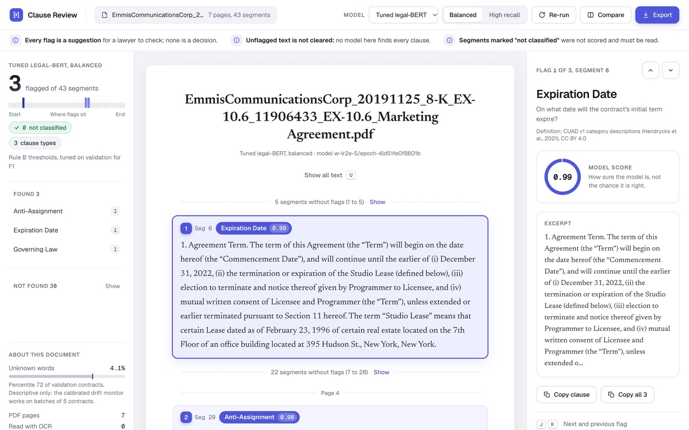

# Clause Review: six contract-clause classifiers, compared honestly

**[Live demo](https://clause-review-alpha.vercel.app)** · **[Case study](https://portfolio-three-rose-44.vercel.app/projects/clause-review)** · [Full results](docs/results.md) · [Build log](BUILD_LOG.md)



Clause Review reads a commercial contract and points a lawyer to the clauses worth checking: 33 clause types such as Anti-Assignment, Change Of Control and Governing Law. Behind it is a comparison of six models on CUAD, 510 contracts labeled by lawyers: a TF-IDF baseline, two fine-tuned legal-BERTs, two prompted proprietary LLMs (Claude and Gemini), and an open-weights LLM served on Fireworks (DeepSeek V4.1 Flash). Every rule that decides a result was written down before the result existed, and every score carries a contract-level interval.

The live demo is a review aid: each flag is for a lawyer to check, and unflagged text is not cleared. The first visit after a quiet spell takes about a minute while the server starts.

## Key findings

- **Gemini is the best model, and the lead holds up.** Test macro-F1 0.7237 [0.6997, 0.7455]; higher than Claude on both metrics on test after correcting for multiple comparisons.
- **An open model matches a frontier model at about a ninth of the cost.** DeepSeek, run with Gemini's frozen prompt and no tuning of its own, cannot be told apart from Claude; its test and shift runs cost $1.12 against $9.66.
- **A model that runs locally does the same.** The tuned legal-BERT keeps contract text on the firm's own machines and cannot be told apart from Claude.
- **Every model loses accuracy on unfamiliar contract types.** On the same 17 clause types, Gemini's macro-F1 falls from 0.7333 on test to 0.5753 on Franchise and Transportation contracts, which no model saw in training. A label-free drift monitor did not detect the shift.
- **The deployed service reproduces the evaluation exactly.** A pre-registered check found 0 changed flags in 399,036 label decisions on Cloud Run, with the same result on GKE.

## How the numbers were kept honest

- **Pre-registered rules.** Metrics, thresholds, selection rules and comparison families are written down in `BUILD_LOG.md` before the results they govern exist. For Steps 4b to 8 the commit history shows the pre-registration commit before the results commit.
- **One look at test.** Every choice (hyperparameters, prompts, thresholds, model selection) is made on validation. Each model is run once on test.
- **Contract-level splits and a shift set.** Splits are by contract, stratified by contract type. Franchise and Transportation contracts (28) are held out entirely as a distribution-shift set.
- **Paired, contract-level bootstrap.** Model differences use 10,000 paired resamples of whole contracts, with Bonferroni-adjusted intervals across a pre-registered family of 12 comparisons. A difference is claimed only when the adjusted interval excludes zero, and claims that clear it narrowly are labeled marginal.
- **The deployment is checked against the evaluation.** The parity check sends 20 validation contracts to the deployed service and compares every flag with the evaluated predictions. A GKE run that lost one request to a dropped connection is kept as a failure, next to the passing rerun.
- **Failures are kept.** The first fine-tuned transformer (6a) came last on test. That result stays in the record as it is. A tuned successor (6c) was pre-registered afterwards as a separate, post-hoc model, with a stricter interval for the second look at test.

## Results so far

Test (Rule A labels) and shift (Rule C labels), point [95% contract-bootstrap CI], one held-out run per model. From [`docs/results.md`](docs/results.md), which cites the command behind every table.

| Scope | Metric | baseline | claude | gemini | transformer (6a) | transformer-tuned (6c) | deepseek (6b) |
|---|---|---|---|---|---|---|---|
| test \| Rule A | macro-F1 | 0.6311 [0.6043, 0.6532] | 0.6754 [0.6476, 0.7019] | 0.7237 [0.6997, 0.7455] | 0.5408 [0.5180, 0.5591] | 0.6695 [0.6422, 0.6924] | 0.6828 [0.6570, 0.7076] |
| test \| Rule A | micro-F1 | 0.6659 [0.6434, 0.6907] | 0.7156 [0.6920, 0.7404] | 0.7506 [0.7273, 0.7757] | 0.5756 [0.5550, 0.5977] | 0.6886 [0.6650, 0.7131] | 0.7136 [0.6904, 0.7398] |
| shift \| Rule C | macro-F1 | 0.4740 [0.4186, 0.5332] | 0.5246 [0.4749, 0.5853] | 0.5753 [0.5349, 0.6278] | 0.4487 [0.4052, 0.5019] | 0.5449 [0.5013, 0.5913] | 0.5552 [0.4984, 0.6199] |
| shift \| Rule C | micro-F1 | 0.5027 [0.4472, 0.5631] | 0.5688 [0.5254, 0.6224] | 0.5843 [0.5453, 0.6364] | 0.4867 [0.4467, 0.5300] | 0.5763 [0.5329, 0.6181] | 0.5842 [0.5284, 0.6440] |

- Paired comparisons (10,000 contract-level resamples, Bonferroni over each pre-registered family of 12):
  - Gemini is higher than the baseline on both metrics, on test and on shift.
  - 6a is below the baseline, Claude and Gemini on test.
  - 6c is higher than the baseline on 3 of 4 measures, cannot be distinguished from Claude, and is below Gemini on test.
  - DeepSeek (6b), run under Gemini's frozen prompt with no iteration of its own, is higher than the baseline on all 4 measures, cannot be distinguished from Claude, and is below Gemini on test. Its test and shift runs cost $1.12, against $4.53 for Gemini and $9.66 for Claude.
  - The full claim tables, including which claims are marginal, are in `docs/results.md`.
- Contamination caveat: CUAD has been public since 2021, so Claude, Gemini and DeepSeek may have seen these contracts and labels in training. The shift set is part of the same release.

## Steps

| Step | What | Where |
|---|---|---|
| 1 | Data: contract-level splits, shift set, segmentation, span-to-segment labels | BUILD_LOG Step 1, `docs/labeling_schema.md` |
| 2 | Baseline: TF-IDF + one-vs-rest logistic regression, per-class thresholds on validation | BUILD_LOG Step 2 |
| 3 | LLM classifiers: prompt iteration on validation, response cache, spend ledger with a hard cap | BUILD_LOG Step 3 |
| 4 | Evaluation harness, paired comparisons, calibration | BUILD_LOG Step 4, `docs/results.md` |
| 5 | Label-free drift monitoring, calibrated on validation | BUILD_LOG Step 5 |
| 6a | Fine-tuned transformer: three encoders, one fixed recipe, selection on validation | BUILD_LOG Step 6a |
| 6c | Tuned legal-BERT successor, post-hoc: loss-weighting and learning-rate grid, 20 checkpoints, selection on validation | BUILD_LOG Step 6c |
| 6b | Open model on Fireworks: DeepSeek V4.1 Flash under the frozen LLM protocol, judged smoke gate, no prompt iteration | BUILD_LOG Step 6b |
| 7 | Review service: text or PDF, high-recall option, spend-capped LLM, extraction quality measured | BUILD_LOG Step 7, `docs/results.md` |
| 8 | Deployment: one Docker image on Cloud Run (live) and GKE (verified, torn down), Vercel front end, parity check | BUILD_LOG Step 8, `docs/results.md` |
| 9, 10 | Fresh non-CUAD test set, then an ensemble evaluated only on it (next) | `docs/plan.md` |

## Layout

```
src/            library code; src/config.py holds the seed, paths and every setting
  llm/          LLM classifiers, prompts, cache, budget
tests/          pytest suite (CPU only, no downloads, no API calls)
service/        FastAPI review service
web/            static front end for the review service (deployed on Vercel)
deploy/         Cloud Run and GKE deploy scripts, Kubernetes manifests
scripts/        code review, service check, deployment parity check, clause definitions
docs/           plan, results, labeling schema, saved plan reviews, images
data/           processed outputs, predictions, evaluation JSON (raw data is not committed)
models/         frozen model metadata and thresholds (weights are not committed)
BUILD_LOG.md    dated decisions, pre-registrations, numbers and problems, step by step
```

## Reproducing

Requires Python 3.11 or later.

```
python -m venv .venv && source .venv/bin/activate
pip install -r requirements.txt
pip install -e . --no-deps
pytest tests -q
```

Data: download `CUAD_v1.zip` from Zenodo (DOI [10.5281/zenodo.4595826](https://doi.org/10.5281/zenodo.4595826)), unzip it into `data/raw/` so that `data/raw/CUAD_v1/CUAD_v1.json` exists, then:

```
python -m src.data
python -m src.splits
python -m src.build_segments
```

Each later step's commands, in order, are in `BUILD_LOG.md`. LLM steps need `ANTHROPIC_API_KEY`, `GEMINI_API_KEY` and `FIREWORKS_API_KEY` in `.env` (see `.env.example`) and cost money; their responses are cached locally.

## Running the review service

The service is a review aid: every flag is for a lawyer to check, and unflagged text is not cleared. It needs the trained artifacts from the earlier steps (model weights are not committed), and Tesseract for scanned pages (`brew install tesseract`).

```
uvicorn service.app:app --port 8000 --workers 1
```

Open http://localhost:8000 to paste text or upload a PDF, or use the JSON API: `GET /models`, `POST /classify` (`text`, `model`, `operating_point`), `POST /classify/pdf` (multipart). Models: `baseline`, `transformer-tuned` and `fireworks-deepseek` (needs `FIREWORKS_API_KEY`; sends the text to Fireworks). Operating points: `balanced` (Rule B) and `high_recall`, tuned on validation, where it raises recall at a large precision cost (`docs/results.md`, Service).

DeepSeek spend has its own ledger, capped at `SERVICE_LLM_CAP_USD` ($5 by default) and at the project's $150 total. A request is refused before any call if its worst case exceeds `SERVICE_REQUEST_CAP_USD` ($0.50 by default, about 65 windows of 10 segments); a retry after an unparsable reply can take one request to about twice that. Other settings: `SERVICE_MODELS`, `SERVICE_MAX_UPLOAD_MB`.

## Deploying

The image bakes in the frozen baseline and the selected tuned legal-BERT checkpoint (`.gcloudignore` lists what is uploaded; check it with `gcloud meta list-files-for-upload .`). With a GCP project, the Cloud Run, Artifact Registry, Cloud Build and Kubernetes Engine APIs enabled, and an Artifact Registry repository `cuad`:

```
PROJECT=<project> REGION=us-central1 deploy/cloudrun.sh                     # build and deploy to Cloud Run
python -m scripts.deploy_parity --url <service url> --target cloudrun      # parity against the evaluated predictions
PROJECT=<project> REGION=us-central1 deploy/gke.sh check                    # temporary GKE cluster: deploy, parity, delete
```

The front end in `web/` is static: point `web/config.js` at the service URL, deploy the folder (for example to Vercel with `web` as the root directory), and set `SERVICE_CORS_ORIGINS` on the service to the front end's origin. The deployment serves the baseline and the tuned legal-BERT (`SERVICE_MODELS`); a model whose frozen artifacts fail their check stops the container from starting (`SERVICE_REQUIRE_ALL_MODELS=1`).

## Data and license

- CUAD v1: Hendrycks et al., "CUAD: An Expert-Annotated NLP Dataset for Legal Contract Review", NeurIPS 2021 Datasets and Benchmarks, arXiv:2103.06268. Licensed CC BY 4.0. This repository includes derived labels and model predictions keyed by segment id, not contract text.
- Code: MIT, see [`LICENSE`](LICENSE).
